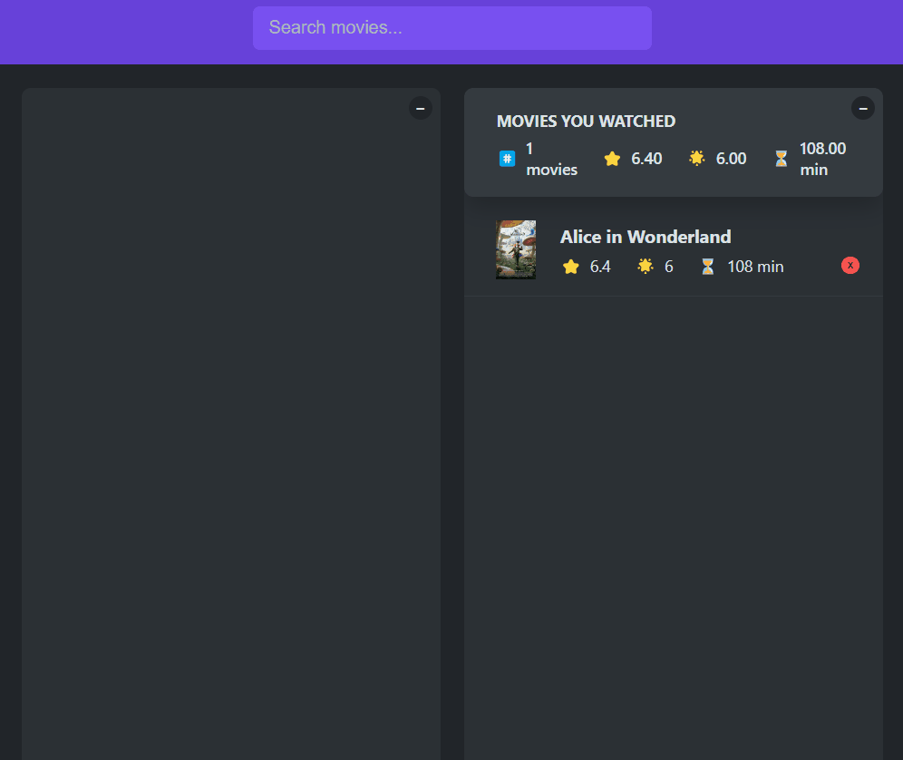

<div align="center">
  <h1> Search Movies 🎬</h1>
</div>

<p align="center">
  Search Movies é uma aplicação React que permite pesquisar filmes usando a API do OMDB. Este projeto foi desenvolvido para fornecer uma interface simples e amigável para buscar informações sobre filmes, como títulos, anos de lançamento, sinopses e avaliações.
</p>

<p align="center">
  <a href="#features">Features</a> •
  <a href="#pré-requisitos">Pré requisitos</a> •  
  <a href="#rodando-a-aplicação">Rodando a aplicação</a> •
  <a href="#tecnologias">Tecnologias</a> •
  <a href="#autor">Autor</a>
</p>

---

<br>

# Demonstração do projeto

<p>Teste a aplicação clicando neste ícone do Netlify:</p>

<a href="https://search-movies-greatwhoone.netlify.app/">

</a>


# Features

- [x] Pesquisa de Filmes: Busque filmes pelo título utilizando a API OMDB.
- [x] Exibição de Resultados: Veja uma lista de filmes correspondentes à sua pesquisa, incluindo pôsteres e informações básicas.
- [x] Detalhes do Filme: Clique em um filme para ver detalhes adicionais, como sinopse, elenco e avaliações.
- [x] Exibição de Resultados: Veja uma lista de filmes correspondentes à sua pesquisa, incluindo pôsteres e informações básicas.
- [x] Lista de Assistidos: Adicione filmes a uma lista de assistidos com sua avaliação pessoal.
- [x] Persistência de Dados: Salva a lista de filmes assistidos usando localStorage, permitindo que os dados sejam preservados mesmo após o fechamento do navegador.
- [x] Atalhos de Teclado:
- - [x] Enter: Foca no campo de pesquisa para uma nova busca.
- - [x] Escape (Esc): Fecha os detalhes do filme selecionado.
- [x] Variáveis de Ambiente: A chave de API do OMDB é protegida utilizando variáveis de ambiente configuradas no Netlify.

<br/>
  <h1 align="center">
    
  </h1>

# Pré requisitos

Você vai ter que ter instalado na sua máquina as seguintes ferramentas:

- [GIT](https://git-scm.com/)
- [Node.js](https://nodejs.org)

Recomendo a utilização do [VS Code](https://code.visualstudio.com/) para editar o código.

# Rodando a aplicação

```bash
# Clone o repositório
git clone https://github.com/GreatWhoOne/search-movies

# Entre na pasta do projeto
cd search-movies

# Instale as dependências
npm install

# Rode a aplicação
npm start

# O servidor iniciará na porta: 3000 - acesse <http://localhost:3000>
```

# Tecnologias

- [React](https://git-scm.com/)
- [OMDB API](https://www.omdbapi.com/)
- [Netlify](https://www.netlify.com/)
- CSS

# Autor

Feitor por Juan 🙋🏾 - [Veja meu LinkedIn](https://www.linkedin.com/in/juan-cruz-pereira/)
